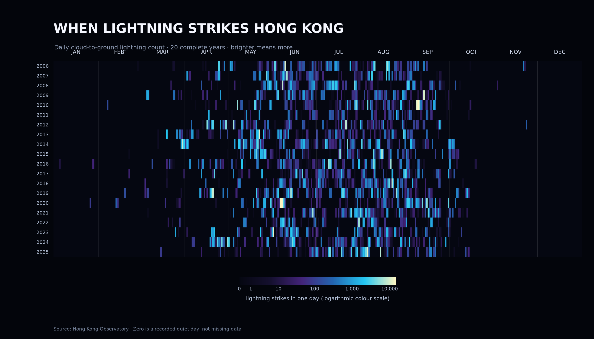

# When Lightning Strikes Hong Kong



## The phenomenon

Lightning is brief, irregular and strongly seasonal. I wanted to see when Hong
Kong's lightning season begins and ends, and whether its timing looks consistent
from year to year. The picture uses twenty complete calendar years, from 2006 to
2025, rather than the incomplete first and last years in the source file.

## The source

The data comes from the [Hong Kong Observatory's daily cloud-to-ground lightning
dataset](https://data.gov.hk/en-data/dataset/hk-hko-rss-daily-cloud-to-ground-lightning-count).
The committed CSV contains 7,742 daily observations from 21 June 2005 to 31 August
2026. Each row gives a year, month, day, the total number of cloud-to-ground
lightning strikes detected over Hong Kong territory, and a data-completeness flag.
The plotting script uses the 7,305 observations belonging to the twenty complete
years.

## What the picture shows

Each row is one year and each narrow column is one calendar day. Brighter colours
mean more lightning. The band of activity grows during spring, is strongest from
roughly May to September, and almost disappears in winter. Across the twenty years,
5,630 days recorded no cloud-to-ground lightning; the largest daily count was
14,600 on 9 September 2010. A logarithmic colour scale keeps moderate days visible
beside these rare extremes.

The picture hides where and what time each strike happened. It also combines all
storms on the same day and does not include cloud-to-cloud lightning, so it shows
seasonal timing rather than the geography or structure of individual storms.

## Run it

```bash
uv run fetch.py
uv run plot.py
```
