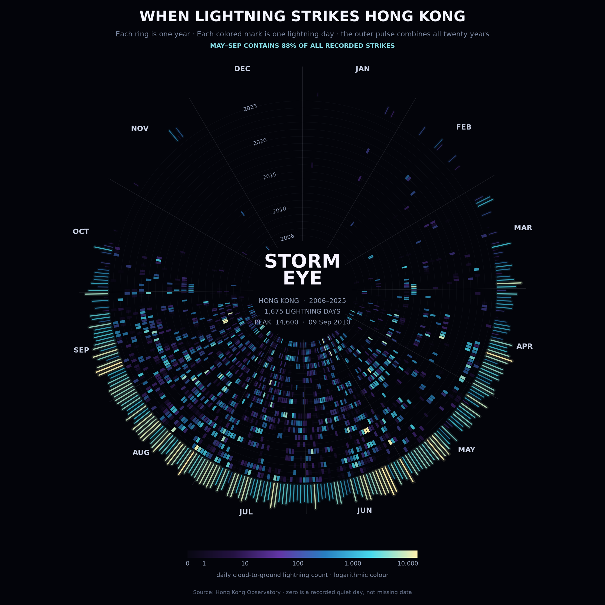
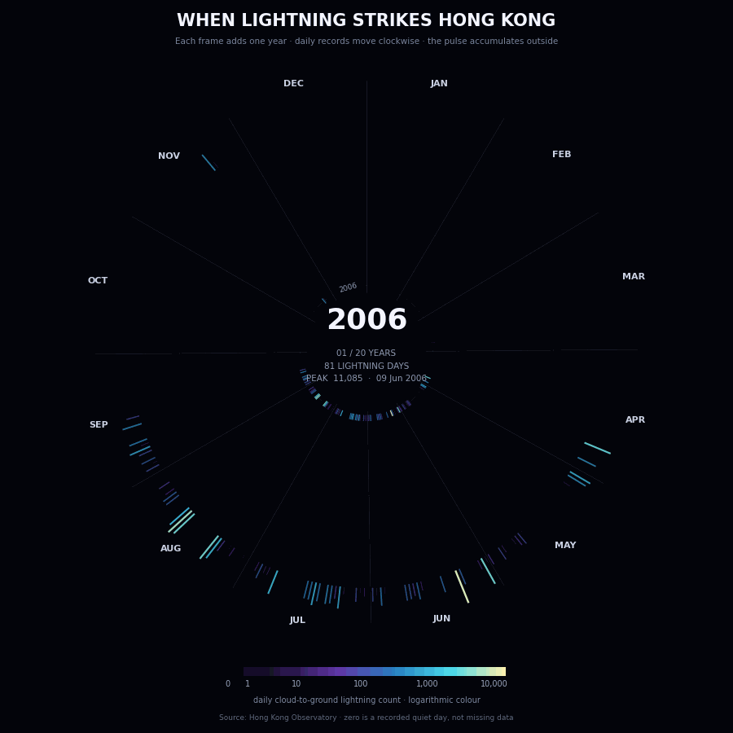

# When Lightning Strikes Hong Kong

Across twenty complete years, no cloud-to-ground lightning was recorded over Hong
Kong on 77% of days. But when the summer storms arrive, a single day can bring more
than fourteen thousand strikes.
This project turns twenty complete years of daily observations into a circular
calendar, revealing when Hong Kong's lightning season begins, peaks and disappears.



## The phenomenon

Lightning is brief, irregular and strongly seasonal. I wanted to see whether the
timing of Hong Kong's lightning season remains consistent even when its intensity
changes from year to year. The pictures use twenty complete calendar years, from
2006 to 2025, rather than the incomplete first and last years in the source file.

## The source

The data comes from the [Hong Kong Observatory's daily cloud-to-ground lightning
dataset](https://data.gov.hk/en-data/dataset/hk-hko-rss-daily-cloud-to-ground-lightning-count).
The [committed CSV](data/hko-daily-cloud-to-ground-lightning-all-years.csv) is the
raw reply downloaded by `fetch.py`. It contains 7,742 daily observations from 21
June 2005 to 31 August 2026. Each row gives a year, month, day, the total number of
cloud-to-ground lightning strikes detected over Hong Kong territory, and a
data-completeness flag. The pictures use the 7,305 observations belonging to the
twenty complete years.

## The pictures

| Command | Makes | What it is |
| --- | --- | --- |
| `uv run plot.py` | `out/lightning-calendar.png` and `out/lightning-storm-eye.png` | the first analytical heatmap and the final circular calendar |
| `uv run animate.py` | `out/lightning-storm-eye.gif` | one complete year added per frame, from 2006 to 2025 |

In the circular calendar, the angle represents the day of the year, moving
clockwise from January to December. Each ring is one year, growing outwards from
2006 to 2025, and each coloured mark is one day with recorded lightning. The pulse
around the edge combines all twenty years. Brighter colours mean more lightning.



**What the pictures show:** Although the intensity varies greatly from year to
year, the seasonal position remains remarkably stable. About 88% of all recorded
strikes occur between May and September, while winter is almost completely quiet.
Across the twenty years, 1,675 days recorded lightning; the largest daily count was
14,600 on 9 September 2010.

**What they hide:** Each value combines all cloud-to-ground strikes across Hong
Kong into one daily total. The pictures do not show the location or time of each
strike, the structure of individual storms, or cloud-to-cloud lightning. The
logarithmic colour scale keeps moderate storms visible beside rare extremes, but
this also means that visual brightness is not proportional to the raw count.
Incomplete observations from 2005 and 2026 remain in the committed file but are
not drawn.

## Run it

```bash
uv run fetch.py
uv run plot.py
uv run animate.py
```
